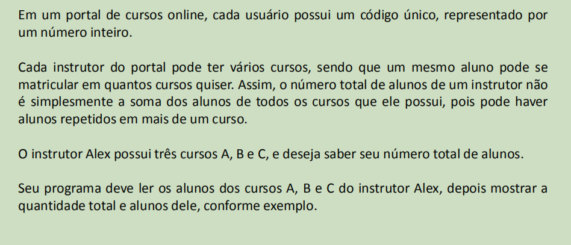
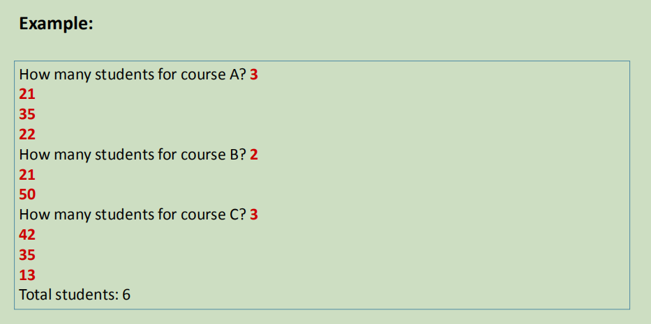
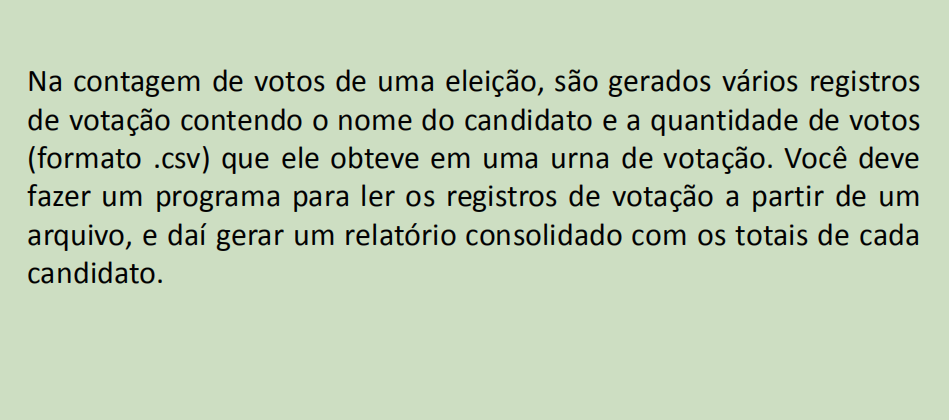
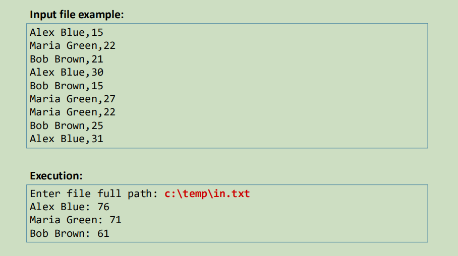

# Sistema de Portal Escolar (SET) - Sistema de Votação (Dictionary)

É uma atividade do *Módulo 15* do curso de `C# Completo Programação Orientada a Objetos (POO)` Do professor `Nélio Alves`. 
Curso existente na plataforma [Udemy](https://www.udemy.com/course/programacao-orientada-a-objetos-csharp/).

* Implementar um portal escolar, utilizando a estrutura `SET`;
* Implementar um sistema de votação, utilizando a estrutura `Dictionary`;
* Apresentado os conceitos de: Generics, Set, Dictionary.

## Exercício Portal Escolar (SET)

### Problemática:

### Exemplo para teste:

## Exercício Sistema de Votação (Dictionary)

### Problemática:

### Exemplo para teste:

## Dados do Autor

Autor: `Matheus Glauber Rodrigues Jordão` [Linkedin](https://www.linkedin.com/in/matheusglauber/).
